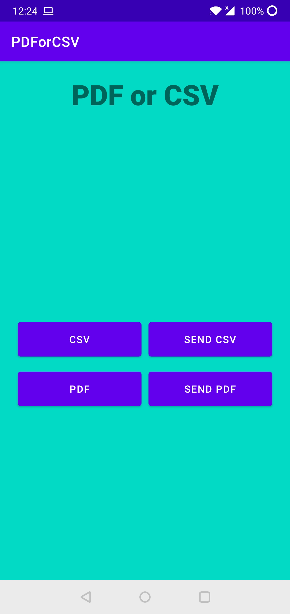
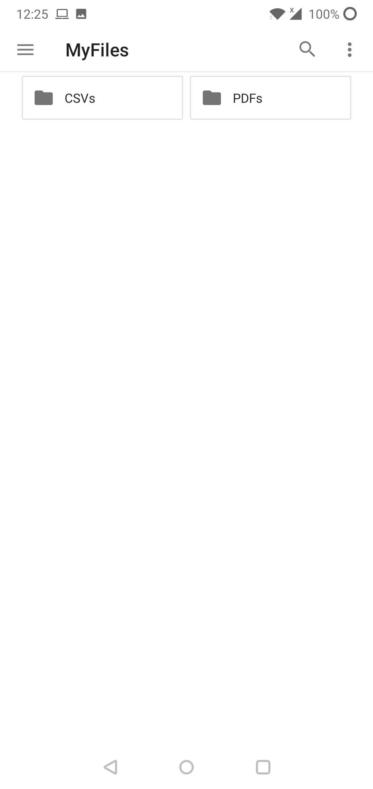
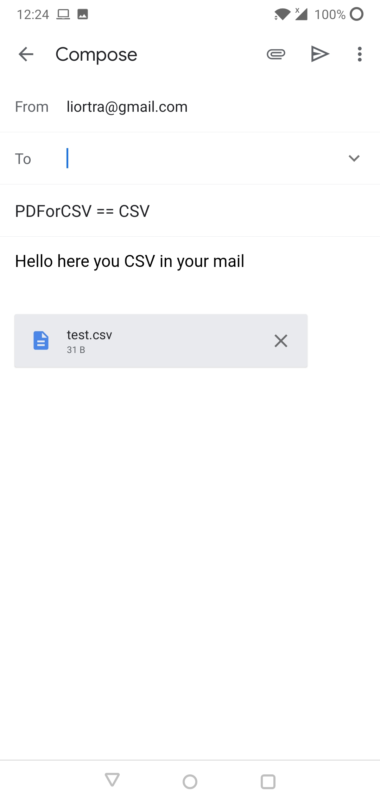
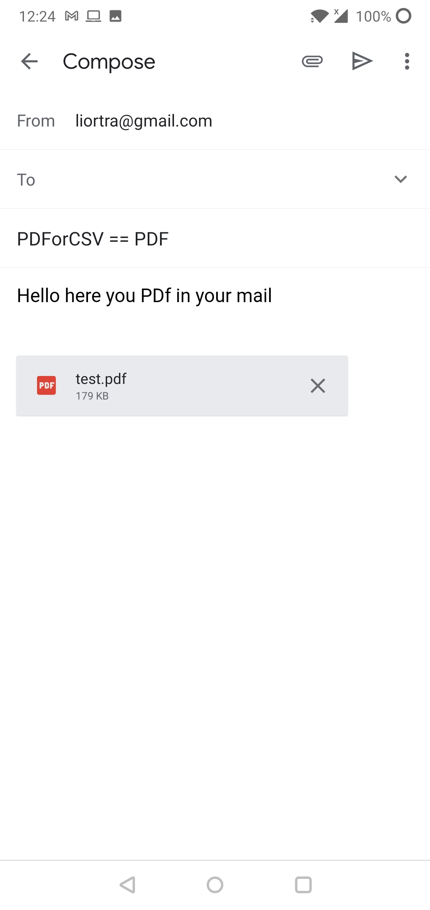

# PDForCSV
PDF or CSV library creator

## Table of Contents
* [Explanation](https://github.com/Liortra/PDForCSV/blob/master/README.md#explanation)
* [Setup](https://github.com/Liortra/PDForCSV/blob/master/README.md#setup)
* [How To Use](https://github.com/Liortra/PDForCSV/blob/master/README.md#how-to-use)
* [Note](https://github.com/Liortra/PDForCSV/blob/master/README.md#note)
* [License](https://github.com/Liortra/PDForCSV/blob/master/README.md#license)

|

## Explanation
A simple library help you to create a CSV file or PDF file and send them by email.
Here you have a simple app that use the library to show you how to works.

## Setup
Step 1. Add it in your root build.gradle at the end of repositories:
```
allprojects {
  repositories {
    maven { url 'https://jitpack.io' }
  }
}
```

Step 2. Add the dependency:

```
dependencies {
  implementation 'com.github.Liortra:PDForCSV:1.00.1'
}
```

##  How To Use
**1.** Add permission at you manifest
```Java
    <uses-permission android:name="android.permission.INTERNET" />
    <uses-permission android:name="android.permission.READ_EXTERNAL_STORAGE" />
    <uses-permission android:name="android.permission.WRITE_EXTERNAL_STORAGE" />
  ```
  
**2.** Add requestLegacyExternalStorage at you manifest/application
```Java
 <application
        android:requestLegacyExternalStorage="true"
  ``` 
  
**3.** Add provider at you manifest/application
```Java
 <provider
            android:name="androidx.core.content.FileProvider"
            android:authorities="${applicationId}.provider"
            android:exported="false"
            android:grantUriPermissions="true">
            <meta-data
                android:name="android.support.FILE_PROVIDER_PATHS"
                android:resource="@xml/provider_paths" />
        </provider>
  ``` 
  
**4.** Add provider at you res/xml
```Java
  <?xml version="1.0" encoding="utf-8"?>
<paths>
    <external-path name="external_files" path="."/>
</paths>
  ``` 
  
**5.** Now you can use the methods of EmailSender & PDFMaker & CSVMaker (i add an example of mine)
```Java
      private void sendPDF() {
        String fileName = "test";
        String textToMail = "Hello here you PDf in your mail";
        String email = "liortra@gmail.com";
        String subject = "PDForCSV == PDF";
        EmailSender.sendPdfToEmail(this,fileName,textToMail,email,subject);
    }

    private void sendCSV() {
        String fileName = "test";
        String textToMail = "Hello here you CSV in your mail";
        String email = "liortra@gmail.com";
        String subject = "PDForCSV == CSV";
        EmailSender.sendCsvToEmail(this,fileName,textToMail,email,subject);
    }

    private void createPDF() {
        String fileName = "test";
        List<String> list = Arrays.asList("data1","data2","data3","data4");
        PDFMaker.createMyPDF(fileName,list);
    }

    private void createCSV() {
        String fileName = "test";
        String HEADER = "Info";
        List<String> list = Arrays.asList("data1","data2","data3","data4");
        CSVMaker.writeToCsv(fileName,list,HEADER);
    }
```

## Note
The app will ask your premission for your storage, please allow it.

## License

    Copyright 2021 Lior Trachtman

    Licensed under the Apache License, Version 2.0 (the "License");
    you may not use this file except in compliance with the License.
    You may obtain a copy of the License at

       http://www.apache.org/licenses/LICENSE-2.0

    Unless required by applicable law or agreed to in writing, software
    distributed under the License is distributed on an "AS IS" BASIS,
    WITHOUT WARRANTIES OR CONDITIONS OF ANY KIND, either express or implied.
    See the License for the specific language governing permissions and
    limitations under the License.

